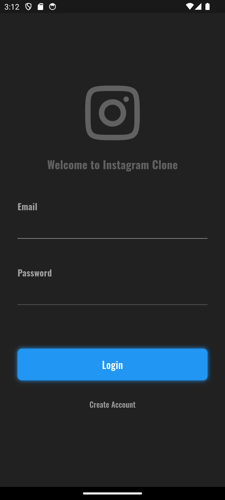
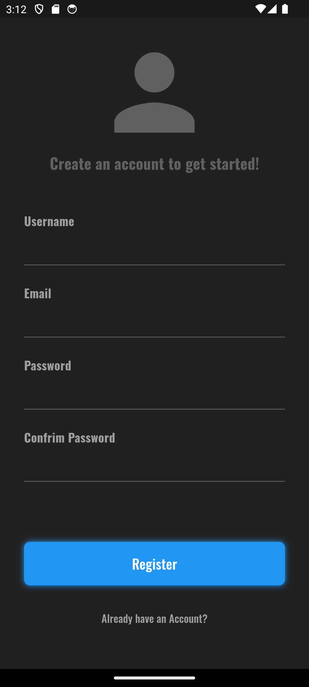

# Instagram Clone - Flutter & Supabase 

This is a simple Instagram clone built using **Flutter** for the frontend and **Supabase** as the backend. The app showcases key features inspired by Instagram, including user authentication, post creation, and feed browsing.

## Features
- **User Authentication**: Sign up, log in, and log out using Supabase's authentication services.
- **Post Creation**: Users can upload images with captions.
- **Feed Browsing**: View posts uploaded by other users in a streamlined, interactive feed.
- **Real-time Updates**: Changes in posts and interactions are reflected instantly, leveraging Supabase's real-time capabilities.
- **Responsive Design**: Optimized for both mobile and tablet devices.

## Technologies Used
- **Flutter**: For creating a modern, responsive, and intuitive UI.
- **Supabase**: For backend services like authentication, storage, and real-time data syncing.
- **Dart**: For coding the application logic.

<table>
  <tr>
    <td align="center" width="20%">
      
    </td>
    <td align="center" width="20%">
      
    </td>
      <td align="center" width="20%">
      
    </td>
      <td align="center" width="20%">
      
    </td>
    
  </tr>
</table>

 ## Contributing

  Feel free to fork this repository and submit pull requests. For major changes, please open an issue first to discuss what you would like to change.

  ## License

  This project is licensed under the MIT License.

